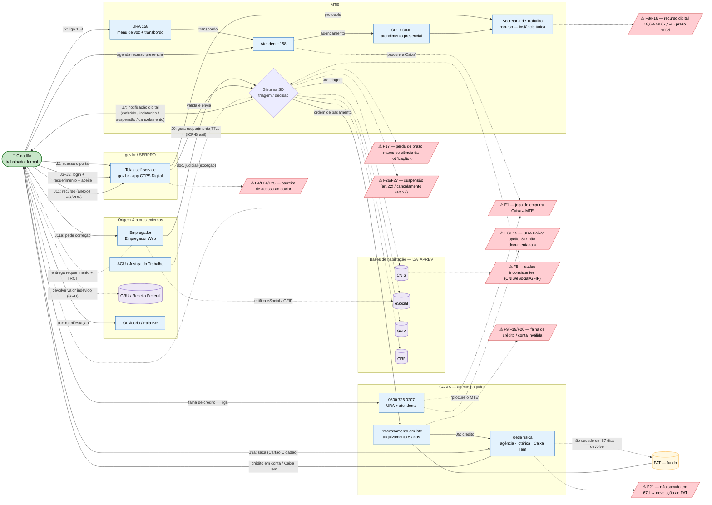

# Diagrama AS-IS — Jornada do Seguro-Desemprego (trabalhador formal)

> Relações entre **etapas** (J0–J13) e **atores** (MTE, Caixa, DATAPREV, SERPRO/gov.br, Empregador, FAT, externos), a partir dos itens da Parte C (`C_blueprint_asis.md`).
> Atores agrupados por instituição (subgraphs); arestas rotuladas = ações/etapas; cilindros = bases de dados; losango = decisão automática; nós vermelhos `⚠` = **fail points**, ligados à relação que os causa.
> Codificação: `○` = lacuna/não comprovado (a URA da Caixa para SD e o marco de ciência aparecem assim).

---

## Como ler

- **Setas cheias** = fluxo principal da jornada (rotulado pela etapa: J0, J2, J3–J5, J7, J9, J9a, J11, J13).
- **Setas pontilhadas** = consultas a bases, exceções e desvios (triagem em J6, correção em base, devolução ao FAT, restituição via GRU).
- **Subgraphs** = fronteiras institucionais. A separação **MTE ↔ Caixa** torna visível a causa de **F1**: dois mundos (habilitação vs. pagamento) que empurram o cidadão entre si.
- **Cilindros** = bases/sistemas (CNIS, eSocial, GFIP, GRF, FAT, GRU). **Losango** `SD` = decisão automática (J6).
- **Nós vermelhos `⚠`** = fail points, ligados ao ator/relação que os origina. São os 9 mais críticos da Parte C (agrupados); os **27 completos**, com tipo, evidência e fonte, estão na tabela `C_blueprint_asis.md`.
- **`○`** marca o que é lacuna: a opção "SD" na URA da Caixa (F3) e o marco exato de ciência da notificação digital (F17).

> Renderiza direto no GitHub (Mermaid nativo). Para editar/exportar: https://mermaid.live
